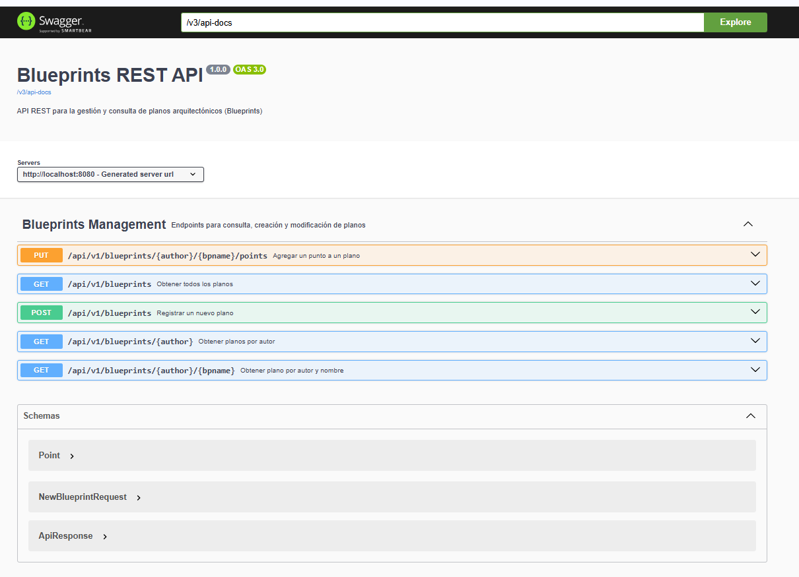
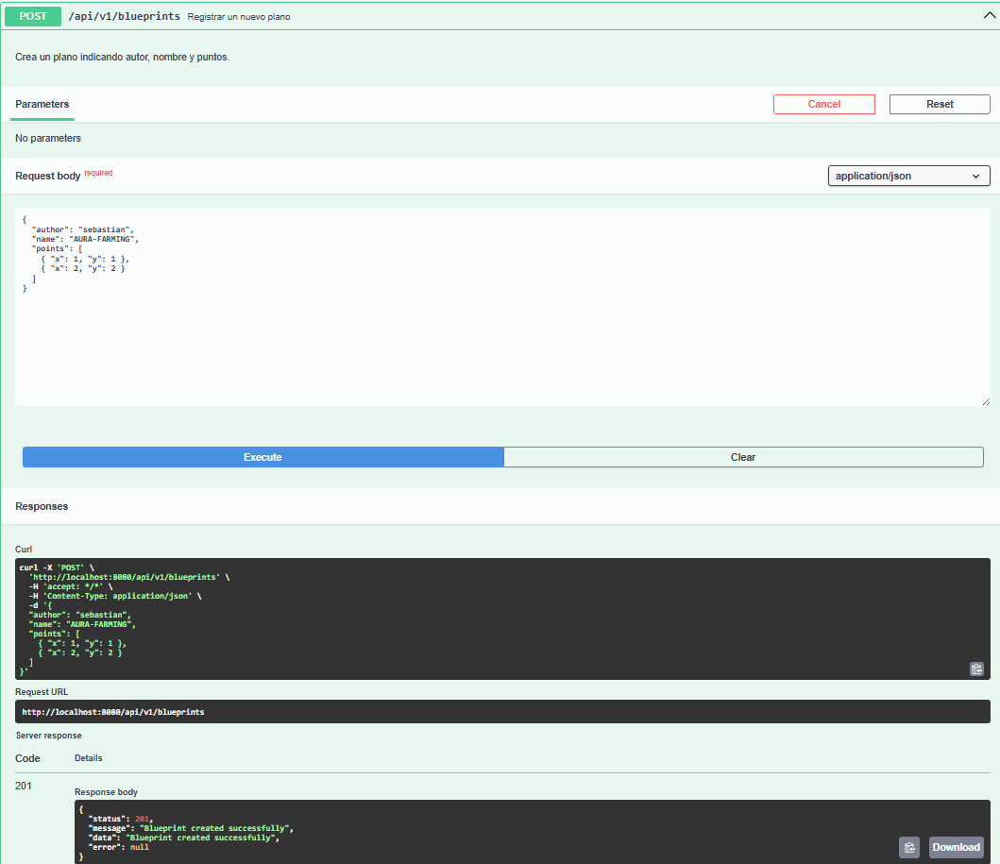
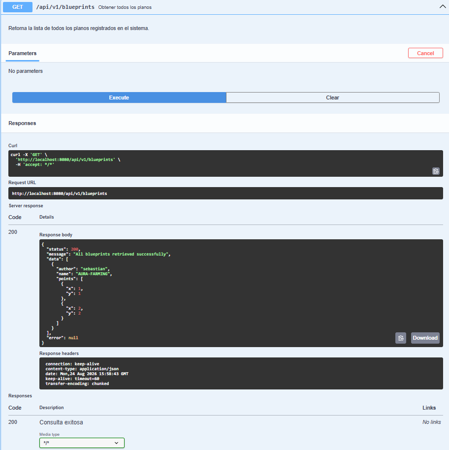
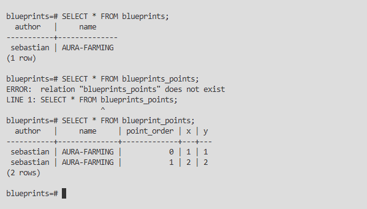

# Informe de Laboratorio #4 – REST API Blueprints

**Materia:** Arquitecturas de Software (ARSW) - Escuela Colombiana de Ingeniería
**Integrantes:** Juan Pablo Vega y Sebastian Aurela

---

## 1. Resumen del Proyecto

En este laboratorio se tomó un proyecto base de Spring Boot y se evolucionó hacia una API REST madura y lista para producción. Las principales mejoras incluyeron la migración de la persistencia de datos (de memoria a PostgreSQL empleando Docker), la estandarización de las respuestas HTTP, la documentación automática de la API y la implementación de filtros dinámicos de datos mediante perfiles de configuración (Spring Profiles).

---

## 2. Instrucciones de Ejecución Paso a Paso

Para facilitar la revisión y pruebas del proyecto, se ha dockerizado el entorno de base de datos. A continuación, se presentan los pasos para iniciar el sistema.

### Paso 1: Levantar la Base de Datos (PostgreSQL en Docker)

Asegúrese de tener Docker Desktop en ejecución (sin esto no se puede). Abra una terminal y ejecute el siguiente comando para levantar el contenedor con la base de datos y las credenciales configuradas:

```bash
docker run --name postgres-blueprints -e POSTGRES_DB=blueprints -e POSTGRES_USER=postgres -e POSTGRES_PASSWORD=pripro -p 5432:5432 -d postgres
```

 **Nota:** El esquema y las tablas se crearán automáticamente al iniciar Spring Boot gracias al archivo `schema.sql` configurado en el proyecto.

### Paso 2: Compilar el Proyecto

En la raíz del proyecto, ejecute:

```bash
mvn clean install
```

### Paso 3: Ejecutar la Aplicación Spring Boot (Prueba de Filtros)

El proyecto implementa el **strategy pattern ** mediante `@Profile` de Spring para filtrar los puntos de los planos. Puede iniciar la aplicación de tres formas distintas según el comportamiento deseado.

**Opción A: Ejecución normal (Sin alterar puntos)**

Utiliza el `IdentityFilter`. Los puntos se guardan y consultan exactamente como se envían.

```bash
mvn spring-boot:run
```

**Opción B: Activar Filtro de Redundancia**

Elimina puntos consecutivos duplicados. Por ejemplo, `(1,1), (1,1)` se reduce a `(1,1)`.

```bash
mvn spring-boot:run -Dspring-boot.run.profiles=redundancy
```

**Opción C: Activar Filtro de Submuestreo (Undersampling)**

Reduce la densidad del plano conservando únicamente 1 de cada 2 puntos (índices pares).

```bash
mvn spring-boot:run -Dspring-boot.run.profiles=undersampling
```

---

## 3. Evidencias de Ejecución y Pruebas

A continuación, se comprueba el correcto funcionamiento de los endpoints, la documentación Swagger y la persistencia de datos.

### A. Interfaz y Documentación (Swagger UI)

La documentación fue generada automáticamente con `springdoc-openapi` y está disponible en:

`http://localhost:8080/swagger-ui.html`



### B. Pruebas de Inserción y Consulta (Endpoints)

#### 1. Creación de un plano (POST `/api/v1/blueprints`)

Se envió un payload JSON creando un plano y el servidor respondió con el estado adecuado, confirmando la creación.



#### 2. Consulta del plano (GET `/api/v1/blueprints`)

Al realizar la petición, el sistema envuelve la respuesta en el formato estándar y retorna un código exitoso.



### C. Persistencia en Base de Datos (PostgreSQL)

Se verificó directamente en el contenedor de Docker que el motor relacional está almacenando los registros correctamente mediante la implementación `PostgresBlueprintPersistence` y `JdbcTemplate`.



* Si quieren verificar esta imagen pueden hacer lo siguiente:
    * Abren una nueva pestaña en la terminal (mientras que el docker sigue corriendo).

    * Ejecutamos este comando para entrar a la consola interactiva de PostgreSQL dentro de nuestro contenedor:

    * `docker exec -it postgres-blueprints psql -U postgres -d blueprints`

    * Estando ahi hacemos la consultas necesarias

---

## 4. Buenas Prácticas Aplicadas

Durante el desarrollo se integraron estándares profesionales para el diseño de la API:

1. **Versionamiento de API (URI Versioning):**
   El path base se actualizó a `/api/v1/blueprints`, protegiendo la compatibilidad de los clientes actuales frente a futuras versiones.

2. **Códigos de Estado Semánticos:**
   Se abandonó el uso genérico del `200 OK`, implementando respuestas descriptivas:

   * `201 Created` para el registro exitoso de planos.
   * `202 Accepted` para el procesamiento de nuevos puntos.
   * `404 Not Found` para indicar que un recurso no existe.

3. **DTO y Respuestas Uniformes:**
   Se diseñó el `record` `ApiResponse<T>`, asegurando que los clientes (Frontend) siempre reciban un contrato JSON estable con los campos `status`, `message`, `data` y `error`.

4. **Strategy Pattern e Inversion of Control:**
   Los filtros `RedundancyFilter` y `UndersamplingFilter` fueron implementados aplicando el principio OCP (**Open/Closed Principle**) de SOLID. Gracias a la inyección de dependencias y los perfiles de Spring (`@Profile`), es posible alterar el comportamiento algorítmico sin modificar el código fuente base.
